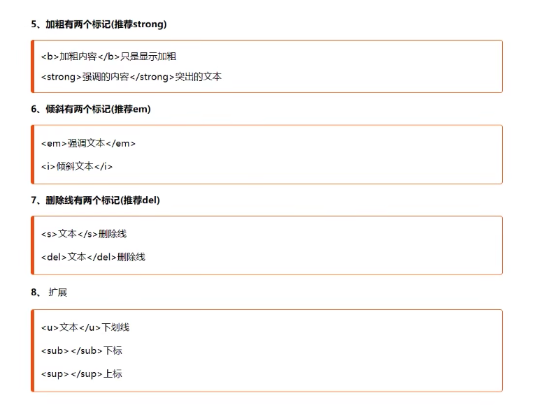
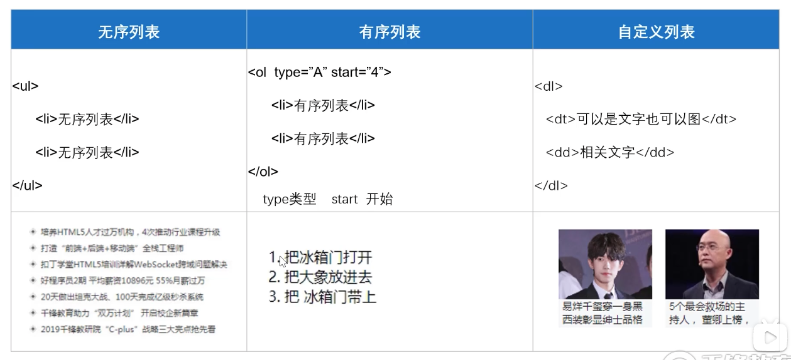

# html 笔记

### meta
```<meta charset="***"> ``` 字符编码，告诉浏览器我们是用什么来编码的，这样浏览器知道用什么字符集解码 可以解决中文乱码的问题

* ASCII 美国编码
* ISO-8859-1  汉字编码
* UTF-8 Unicode  万国码

### h1 - h6 标题标签

标题标签 从 ```<h1></h1> - <h6></h6>```

文本标题自带加粗，有自己的文本大小，独占一行，有默认间距

### p 段落标签

段落标签 ```<p></p>```

段落与段落有间距

### br 换行标签

br就是用来换行用 ```<br/>```

### hr 水平线标签

hr用来画水平线用 ```<hr/>```

hr 身上还能加上不同的属性 比如： color， width，align (left, right)， noshade (无阴影) 

默认aligh居中 shade有阴影

### 其他文字修饰标签




### html中的特殊符号

```&lt;```  左尖角 <
```&gt;```  右尖角 >
```&nbsp;``` 空格 （空格占据宽度受字体影响）
```&emsp;``` 空格 （占据宽度为1个中文宽度，基本不受字体影响）
```&copy;``` 版权符号
```&trade;``` ```&reg;``` 商标

### div和span

div 用来划分页面区域 独占一行

span 用于文本独立修饰的时候 内容多宽 就占多宽的空间距离

### 列表


ul 无序列表
ol 有序列表
* type属性 （type="", 1,a,A,i,I）
* start属性 (start="1") 取值只能是数字

dl 自定义

### img

图片标签接受属性

src 图片路径或地址 