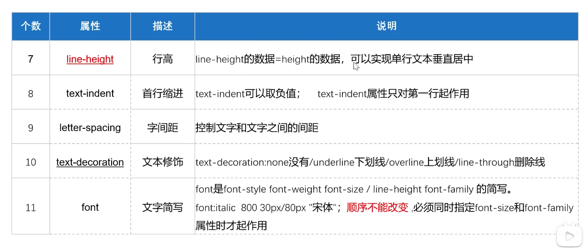

# html 笔记

### meta
```<meta charset="***"> ``` 字符编码，告诉浏览器我们是用什么来编码的，这样浏览器知道用什么字符集解码 可以解决中文乱码的问题

* ASCII 美国编码
* ISO-8859-1  汉字编码
* UTF-8 Unicode  万国码

### h1 - h6 标题标签

标题标签 从 ```<h1></h1> - <h6></h6>```

文本标题自带加粗，有自己的文本大小，独占一行，有默认间距

### p 段落标签

段落标签 ```<p></p>```

段落与段落有间距

### br 换行标签

br就是用来换行用 ```<br/>```

### hr 水平线标签

hr用来画水平线用 ```<hr/>```

hr 身上还能加上不同的属性 比如： color， width，align (left, right)， noshade (无阴影) 

默认aligh居中 shade有阴影

### 其他文字修饰标签


### html中的特殊符号

```&lt;```  左尖角 <
```&gt;```  右尖角 >
```&nbsp;``` 空格 （空格占据宽度受字体影响）
```&emsp;``` 空格 （占据宽度为1个中文宽度，基本不受字体影响）
```&copy;``` 版权符号
```&trade;``` ```&reg;``` 商标

### div和span

div 用来划分页面区域 独占一行

span 用于文本独立修饰的时候 内容多宽 就占多宽的空间距离

### 列表


ul 无序列表
ol 有序列表
* type属性 （type="", 1,a,A,i,I）
* start属性 (start="1") 取值只能是数字

dl 自定义

### img 图片标签

图片标签接受属性

* src 图片路径或地址 
* title 鼠标悬停上去的提示信息
* alt 图片不显示的提示信息（加载失败）
* width 宽度
* height 高度

### a 超链接标签

```<a href="路径" title="鼠标悬停的提示信息" target="规定何处打开文档">内容</a>```

target = "_self" | "_blank"

默认为 _self 也就是在当前页面打开
_blank 表示在新的页面打开

<a></a> 中也可以嵌套其他标签 比如 img


### table 表格

table中可以放两种标签 一个是 tr 一个是 td

tr = table row 表格行
td = table data 表格单元

例子：

```
<table>
    <tr>
        <td>1</td>
        <td>2</td>
    </tr>
    <tr>
        <td>3</td>
        <td>4</td>
    </tr>
</table>
```

#####table 可以接受的属性：

* border： 边框， 单元格也会同时加上边框 
ex： border="1"

* width：宽度 内部单元格会自动等分调整宽度
* height： 高度 内部单元格会自动等分调整

宽度和高度支持 px 和 %， 百分比是相对于父元素的

* align 水平对齐 left | right | center
* bordercolor 边框颜色
* bgcolor 背景颜色
* cellspacing 单元格之间的间距
* cellpadding 单元格与内容之间的空隙的间距


#####tr 可以接受的属性：

* height 高度 如果高于table高度会撑开 table的高度
* bgcolor 背景颜色 会覆盖table设置的颜色
* align 文字水平对齐
* valign 文字垂直对齐 top | middle | bottom

>td 和tr可以接受的属性是一样的

> 如果一个td设置了高度或宽度，也会影响其他行/列的td

##### 表格的合并：

* colspan "所要合并的单元格的**列数**"
* rowspan "所要合并的单元格的**行数**"

##### 表单标签


### CSS

css就是给html加样式的，分为内部样式，行内样式和外部样式

* 内部样式
  - 通过style标签插入html中
  - ```<style> h1 {color: 'red'} </style> ```
* 外部样式
  - 通过外部的 css文件 使用import来倒入
  - ``` import './index.css' ```
  - 通过link标签 引入外部css
  - ```<link rel="stylesheet" type="text/css" href="./index.css"```

* 行内样式
  - ```<div style="width: 200px; color:red;"></div>``` 在任何标签中加入style属性


##### link 和 import的区别
1. link属于 xhtml标签，  import是css提供的方式
2. 当页面被加载时 link引用的css会同时被加载，而import的css会等到页面全部被下载完再被加载， 所以有时候用import加载的css页面最开始可能会没有样式或者闪烁
3. import在老的浏览器上不支持，link没有这个问题


##### css的优先级

行内标签 > 内部标签 > 外部标签

### 选择器

* 元素选择器：
  - 直接对元素加上 css
```
div {
    color: red;
}
```

* 类选择器 或者 类名字选择器
  - 对className前面加上点， 来表示类名字选择器

```
<div className="divclass"></div>

.divclass {
    color: red;
}
```

* id选择器
  - 对id前面加上 # 来表示id选择器
  - id具有唯一性

```
<div id="box"></div>

#box {
    color: red;
}
```

* 通配符 *
  - 表示所有元素

```
* {
    margin: 0; // 外边距
    padding: 0; // 内边距
}
```

* 群组选择器
  - 可以吧多个选择器写在一起

```
div, p, h1, .box, #id{
    color: red;
}
```

* 后代选择器
  - 表示特定后代

```
div p {
    color: red;
}

<div>
    <p>text</p>
</div>
```

这里要注意后代选择器和群组选择器的区别，  后代选择器是空格，群组选择器是逗号分隔开的

### 选择器的权重

id > class > 标签选择器

### 文本属性




* line-height： 专门对文本，也就是行高，如果把行高设置成和height一样的高度的话，可以实现文字垂直方向居中


* text-transform 
  - capitalize 首字母大写
  - lowercase 全部小写
  - uppercase 全部大写
  - none 没有属性

### 列表属性


### 浮动属性


### 盒子内边距 padding

内边距用padding来表示， 当使用内边距的时候 相应的会在div外边加上内边距，同时背景属性会继承 （背景色蔓延到内边距）

当有 1个值时 4个方向内边距一样
当有 2个值时 第一个为上下，第二个为左右
当有 3个值时 上 左右 下
当有 4个值时 上 右 下 左

padding不支持负数

### 边框 border

* 背景色也可以蔓延到边框
* border也是复合属性
* border-width,border-style, border-color 和padding的四个值用法相同


### 外边距 margin

* margin 也支持padding四个值的用法
* 背景色无法延伸到外边距
* 外边距是支持负值的
* 屏幕横向居中 margin: 0 auto
  
1. 两个盒子是兄弟关系的时候，如果都有垂直或者水平外边距
   - 垂直方向取外边距最大值
   - 水平方向取总和
2. 两个盒子是父子关系的时候
   - 垂直方向margin对子盒子和父盒子之间无作用 （子盒子margin边距会传递给父盒子） （解决方法）
     - 用padding （需要减去相应padding大小）
     - 给父盒子设置边框
     - 加浮动
     - 给父加 overflow:hidden


### 溢出属性 overflow


### 元素显示类型


有 display：block 的就是 块元素
display： list-item 也是块元素


有 display: inline 就是行内元素

ps: css中 选择器出现 大于符号 > 表示子代选择器

比如：
div > li  这里特指 div元素下 最近的li 


div li 则表示 div元素中 所有 li标签