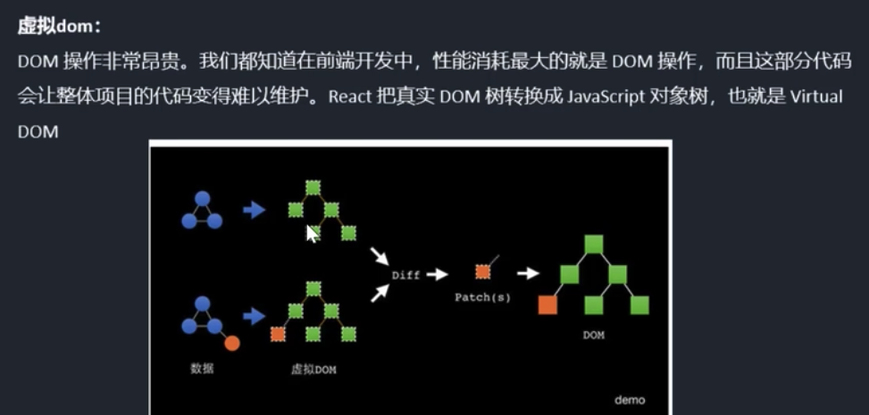

# React Note 01 
* P2：React的特性和虚拟dom
* P3：脚手架 create-react-app

## MVC

* M: model (模型)
* V：view (视觉)
* C：controller (控制) 

React 是一种View层的 开发框架， React把界面分成独立的小块，每一小块就是一个组件，组件结合嵌套就变成了页面

## React 特性

* 声明式设计
* 高效 - React通过对DOM的模拟（虚拟dom）， 最大减少和DOM的操作
* 灵活
* JSX / TSX
* 组件 - 构建组件，使得代码复用
* 单向相应的数据流 - 从父级流向子级

## 虚拟dom

真实dom操作非常昂贵，需要浏览器删除原本dom 然后再重新插入。
而React 是把真实dom 转换成一颗 javascript的对象树， 也就是virtual dom （虚拟dom）

通过对比原本的虚拟dom和新生成的虚拟dom （通过diff算法） 来知道改变在哪，然后标记起来做成patch(s)补丁 然后再操作真实dom



## React 脚手架安装

通过npm 全局安装 create-react-app
```
npm install -g create-react-app
```

通过npx 一次性安装并且创建 myApp

```
npx create-react-app myApp
```

### 脚手架主要是安装三个react的包
* react: react的顶级库
* react-dom： react的运行环境
* react-scripts：运行和打包react的脚本和配置


###### 安装后生成的项目目录
```
|-- README.md
|-- node_modules        所有依赖的安装目录
|-- package-lock.json   锁定安装时的包的版本号， 保证团队依赖一致性
|-- package.json
|-- public              静态公共目录
|-- src                 源代码开发目录

```


## React JSX

JSX 实际上是 JS extend的意思 js + xml。 浏览器实际上还是执行的 html，css， JavaScript。 
当我们用React的时候 实际上是babel把React转化为JavaScript来运行的

babel也是js的编译器

> JSX - 使用react构造函数， babel进行编译 -> Javascript对象 - ReactDom.render() ->  dom元素 -> 插入页面


